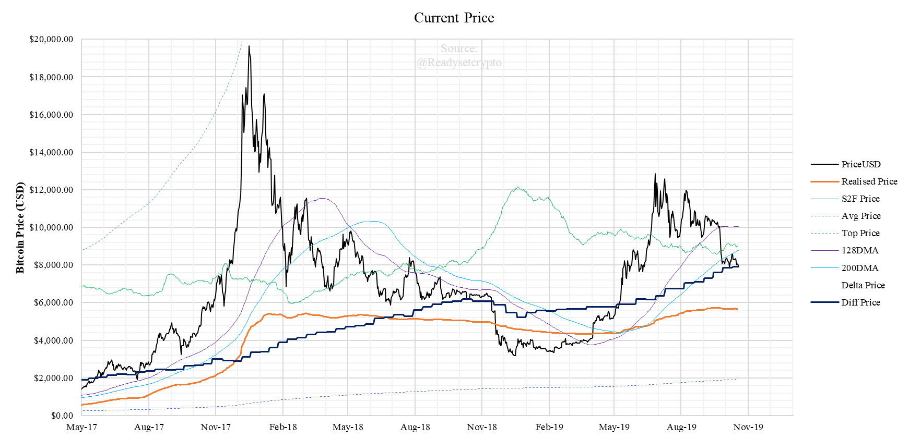
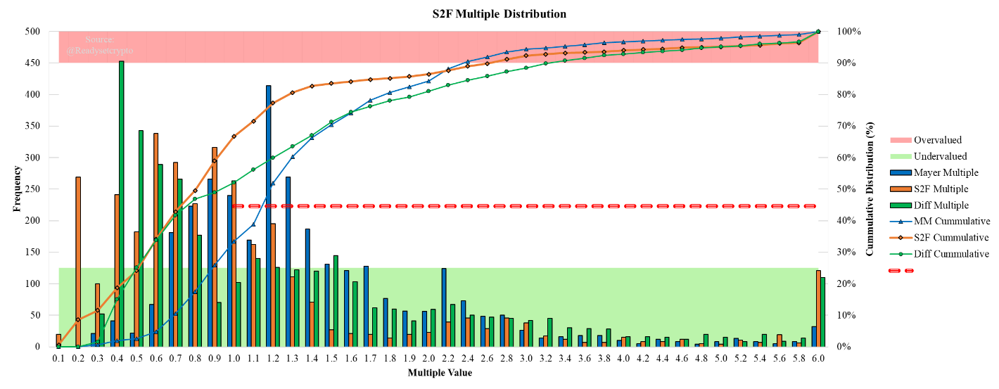
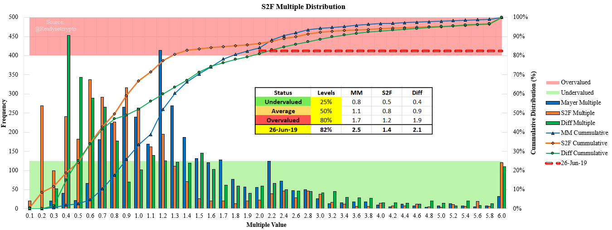
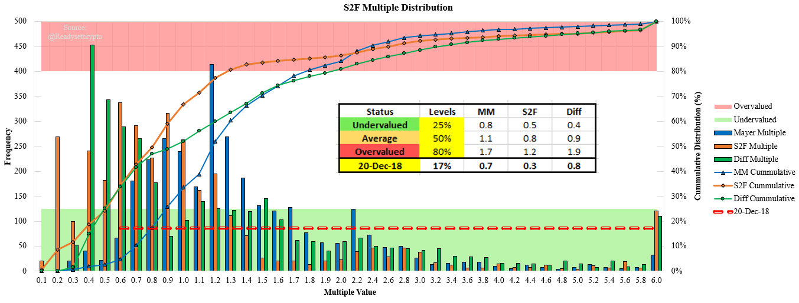
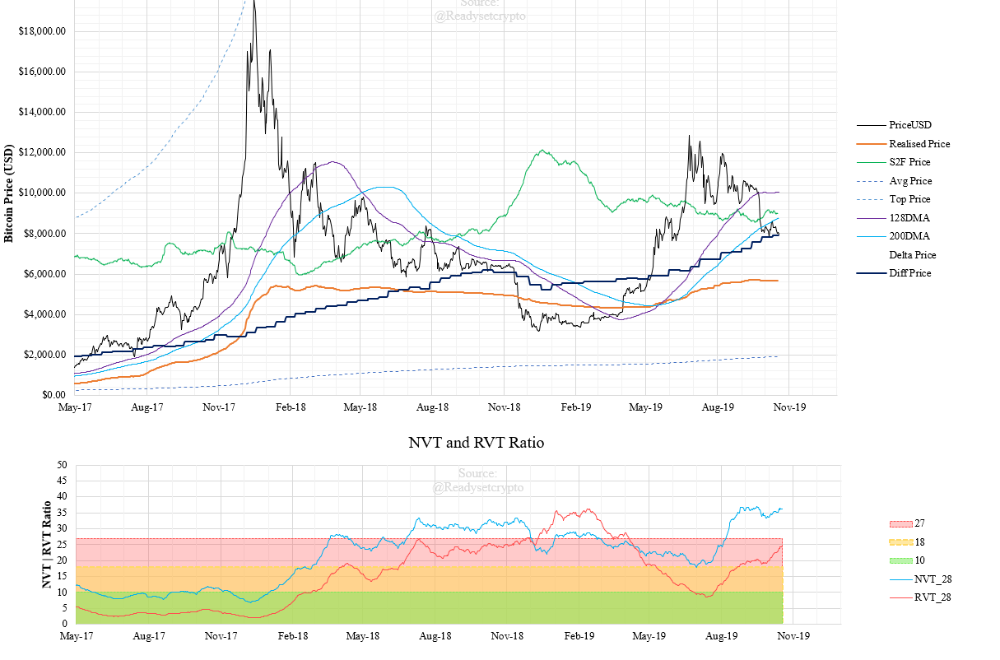

# On-chain Market Update
by Checkmate
20 Oct 2019

The other day I was listening to the Real Vision Podcast interview with Stan Druckenmiller, one of the most well recognised traders and investors in modern markets. I strongly recommend listening to this interview if you haven’t already.

One comment that really stood out to me was when he spoke about his style of trading in equities that is based on interpreting news and acting on price signals, a skill honed over 30 years. What Stan noted is that since the 2008 crisis and with the introduction of central bank stimulus, this tried and trusted method has since lost its edge. This is due to a combination of algorithmic bot and quant traders coupled with the divergence of stock price value away from fundamental values of the company and towards the next Federal Reserve interest rate decision.

No longer do fundamentals drive the behaviour of equities markets, it has become hinged almost solely on the availability of low cost capital from the central bank. What is important to note is that this system is extremely opaque with markets driven by speculation on the rate decision and minutes of the Fed meetings released years after the fact.

## ONCHAIN TRANSPARENCY
With cryptocurrencies, we now have a fully transparent ledger which may be inspected and studied in real time. If we assume that cryptocurrency becomes the standard of value transfer and the base of our monetary system, the average person has the capacity to verify the actual transaction flows, volume on chain and behaviour of the monetary system.

Most importantly, we can verify the total money supply with confidence that it is true.

Let’s combine the assumption that cryptocurrency is here to stay and add it with the capacity to verify the fundamentals of the monetary base chain. Is it that far fetched to see that on-chain analytics will reintroduce the immense market edge enjoyed by Druckenmiller for many decades? Not only does this have dramatic impacts in the form of sound money, for the initiated, it will be an edge not discovered by the majority for decades in my best guess.

By establishing a baseline toolkit of fundamental metrics to study for Bitcoin, it will put you years ahead of the competition. I expect building out your skillset will provide continual edge as you grow your familiarity with the metrics and will be invaluable (and arguably the best way) to buy the bottom and sell the top of this market.

Over time, on-chain metrics will develop for the strongest chains. At this stage, Bitcoin displays the strongest with Ethereum (via DeFi) and Decred (similar to Bitcoin) having their own characteristics which are developing over time. The rest of the chains have no discernible characteristics. 

## AN RSC TOOLKIT
To help build out the skills of everyone in the RSC community in this emerging field of science, I have prepared a spreadsheet tool and guide containing the majority of the key fundamental metrics and charts built in. Today’s newsletter I will be talking through the general features covered in the tool which will also feed into the recorded AMA session for future reference.

All data is obtained from Coinmetrics.io as a .csv download and all you need to do to update the charts is overwrite the attached csv file with the latest data. It is recommended to use Microsoft Excel to access the sheet as it has a superior charting package to Google sheets.

The files are located in the RSC github [here](https://github.com/readysetcryptocodes/Onchain_Analysis/tree/master/onchain_analysis_spreadsheet)

## Market Overview
The best way to demonstrate how to read on-chain indicators is just to dive right in and talk through what is going on with today’s market.

Let’s start with the pricing models chart:

Let’s start with estimating a fair market value for BTC. There are four lines which provide a measure, the 128DMA (purple), 200DMA (light blue), Stock-to-Flow Model (green) and the Difficulty model (dark blue). 

The two ‘magic lines’ (128DMA and 200DMA) represent key levels of support during bull markets and resistance during bear markets. Right now they are above the price which is relatively unchartered territory for a Bitcoin Bull. It is the first piece of evidence that we may be in for a longer term drawdown.

What we can see is that all four of these pricing models are in approximately the same price region with the 200DMA, S2F model and Difficulty model all suggesting a fair value between $7,900 and $9,000. Under that light, it would suggest that any further discount will start pushing the price of Bitcoin into the undervalued range across a number of metrics.

So now we have established that price is under both magic lines (bearish) and is currently trading approximately at its ‘fair’ fundamental value. 

## Distribution Charts
We can now use the historical distribution chart to understand how far over or under valued the price currently is.

We will use the Mayer Multiple (price/200DMA), the S2F Multiple (price/S2F model) and the Diff Multiple (price/Diff Model).

Price has moved above and below these fair price models over its entire history. The further away it gets, the more potential energy it has to return to the mean. The concept here is that the ‘fair price’ should always be a centre of gravity, a mean line that Price wants to return to at all times. Similar to the Bollinger bands, when price goes too far from the mean, it tends to slingshot back.

This chart is showing all the values that the Mayer, S2F and Diff multiples have been over Bitcoins history, multiple values on the x axis. If we look at the bar chart, we can see how many times the Mayer multiple has been 2.4 for example by looking on the left Y axis, called the frequency.

On the right hand axes we have the percentage of Bitcoins life that the multiple has been less than the multiple value on the x axis. If we look at the red line which is where price is currently relative to the models, we see that its at 45%. That means 45% of Bitcoins history has been lower than the models and 55% of Bitcoins history has been much higher than the models.

This in the neutral zone – the potential for a slingshot back to the mean is therefore low. If the red line was in the red or green zones, it would indicate price has gone too far in one direction and is ready for a correction.

In the spreadsheet, you are able to change the date to any time in the past to investigate where this relationship was at the time. As an example, lets look at the $14,000 peak on 26 June 2019 that started the recent consolidation. We can see that the red line was up above 80% meaning only 20% of Bitcoins history was price this far above the ‘fair value’ model prices.

Similarly, on the 20 Dec 2018 at the bottom of the bear market, we can see that the red line was down at 17% indicating only 17% of Bitcoins life was this heavily oversold.

So Right now, Bitcoin is fairly priced but under its magic lines which is overall a relatively average to bearish situation.

As a final check, lets look at the demand side of the equation. Is there a strong demand for block-space that is not yet included in the price.

## THE NVT AND RVT RATIOS
If you recall from the NVT and RVT Masterclass, this is the ratio between Daily on-chain USD value transferred and the Market Cap (NVT) or Realised Cap (RVT). When transactions are high and support the current network value, we expect a low NVT or RVT ratio. Values under 10 especially are very bullish.

The flip side is when the NVT and RVT are in an uptrend and increasing, then the network can generally be considered over valued relative to its utility.

Unfortunately (or fortunately for stacking sats), it seems both ratios are in strong uptrends and in fact are almost as high as they were back in the 2018 bear market. This suggests that there is not a great deal of on-chain volume or demand for blockspace and is generally a bearish indicator.

So overall, price is under heavy resistance (magic lines), is not extremely oversold and has deteriorating blockspace demand. This leads my bias at the current time to expect sideways to downwards price action, generally a bearish sentiment.

## HOW LOW COULD IT GO?
The final piece of the puzzle is where is fundamental support? We can see in the top chart above that the realised price is the last line of defense when it comes to on-chain signals and is currently at $5,670. Yep, its still that low.

What this confirms to me is that the price rise from $5,000 upwards was heavily driven by leveraged trading, a short squeeze and short term speculation. This is exactly what I covered in [my video way back in late June, although I never expected it to take this long to play out](https://www.youtube.com/watch?v=NQOO5Z063zg).

## Concluding Thoughts
I know there was a lot to digest in this paper and even more in the new spreadsheet. My goal here is to help bring every single one of you with me on this journey learning these tools which I believe will make you some of the top 1% of analysts looking at this market. It will be a process but take it slow and remember you can always grab me in Discord to any discuss elements.

If you want edge trading Bitcoin, learn to listen to what Bitcoin has to say. These tools will help you pick-up 95% of the signal coming from the ledger. Use it in combination with Doc’s TA skills and you have a set of extremely high conviction indicators with which you can make decisions.

Tomorrows AMA will cover this spreadsheet and material step by step and I will do as many of them as necessary to walk you though.

