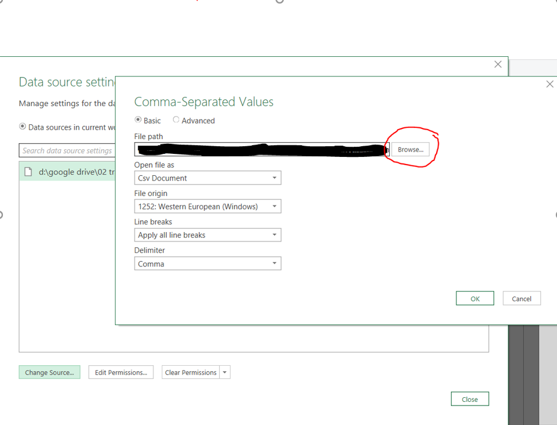

# Guide to On-chain Analysis Spreadsheet
by Checkmate
Last update 20 Oct 2019

This spreadsheet has been compiled to provide the RSC community with a best in class tool for analysing the Bitcoin market via on-chain analysis.

It contains a charting package for all pricing models considered as well as a histogram distribution tool for assessing the Mayer Multiple, S2F Model and Difficulty Adjustment Model. Credit to Trace Mayer and Plan B for the first two.

The Difficulty Model is one developed by Checkmate looking at the linear regression between Price and Difficulty adjustment with ar R2 value of 0.945 so is considered a very high conviction model.

# How to setup the Spreadsheet

All data is sourced from coinmetrics using their data download csv. The model works best on Excel, google Sheets struggles with the charting package.

**Step 1** - download the spreadsheet and put in your working folder

**Step 2** - download the latest btc data from [coinmetrics.io](https://coinmetrics.io/data-downloads/) and place in the same folder

**Step 3** - The spreadsheet has a tab called ```btc``` which is a data query to the csv file. This will need to be updated to your newly downloaded file. You only need to do this once and anytime you re-download coinmetrics data and overwrite the csv, your spreadsheet will automatically update to the latest.

***To setup for the first time, open the spreadsheet and follow these instructions***

```Data > Queries & Connections```

Double click on btc on the right panel and it will open a new popup

```Data Source Settings```


Update the csv source file via Browse


Hit OK and now Save and Close

The spreadsheet is now retargeted to your workspace. In the future all you have to do is download coinmetrics csv and overwrite the old csv to update values.


**Step 4** - Now Bitcoin likes to use log charts. Excel + blank cells + zeros do not go well together with log charts. So we have to do a ```Find and Replace``` for blank cells and pure zeros and swap it for ```=NA()``` which Excel ignores when charting.

- Navigate to the btc tab
- Ctrl+A (Select All)
- Ctrl+F (Find)
- Replace Tab and hit the Options dropdown
- Select Match entire cell contents (stops replacing every single zero, just cells that = zero)

- Find What: ```blank```, Replace with ```=NA()``` --> Replace All
- Find What: ```0```, Replace with ```=NA()``` --> Replace All


